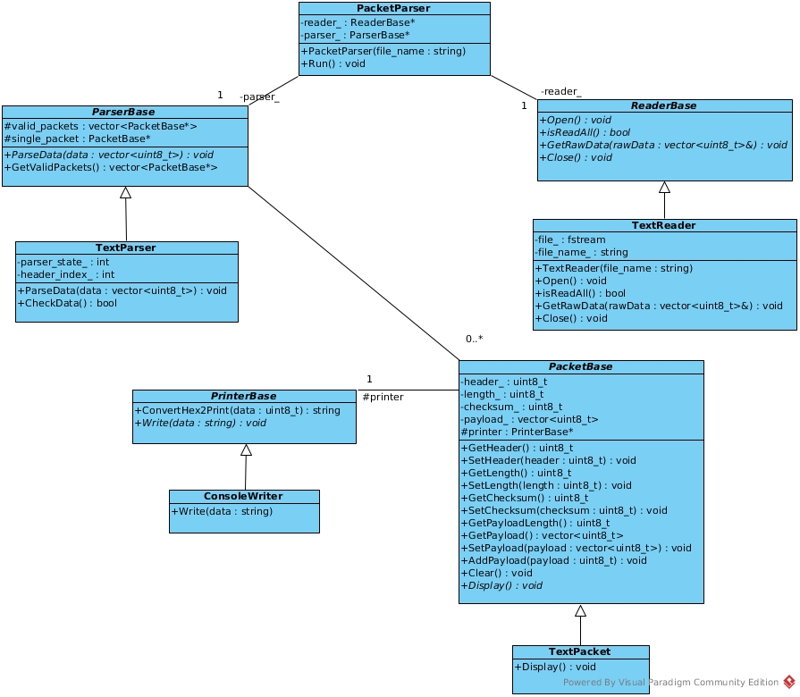

## Project: Packet Parser

### Install

```
  $ git clone https://github.com/makcakoca/parseR
  $ cd parseR
  $ mkdir build
  $ cd build
  $ cmake ..
  $ make
```

### Running

```
  $ ./parseR ../rawdata.txt
```

### Packet Structure

|  Header  |  Length  | Payload            |  Checksum                     |
|  1 Byte  |  1 Byte  | (Length-3) Bytes   |  1 Byte                       |
|  0xAB    |          |                    |  (Sum of all bytes) mod(256)  |

### UML Diagram


